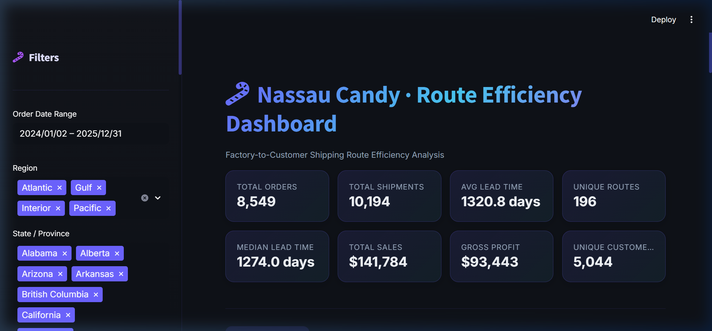
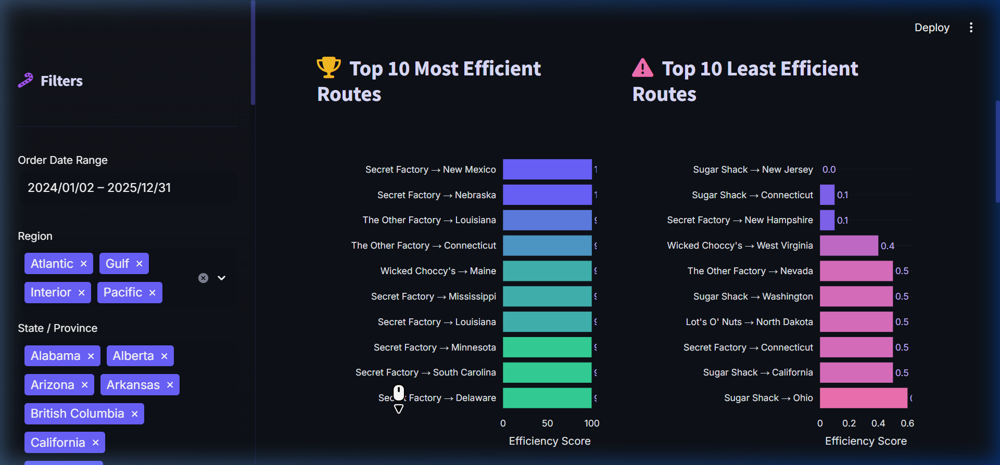
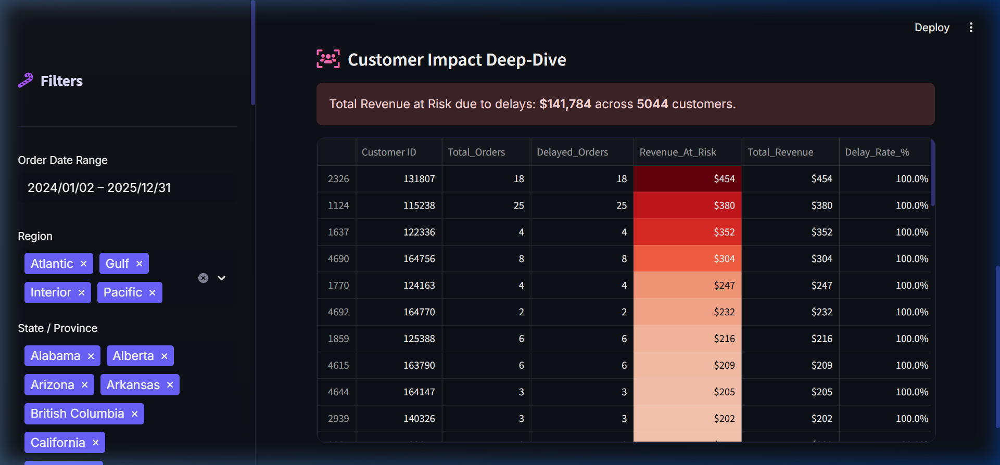

# Research Paper: Product Line Profitability & Margin Performance Analysis

**Organization:** Nassau Candy Distributor  
**Project Title:** Product Line Profitability & Margin Performance Analysis  
**Student Name:** Sougata Mondal  
**Internship Period:** 20/1/2026 to 20/3/2026  

---

## 1. Abstract
In national distribution operations, shipping efficiency is a critical determinant of customer satisfaction, operational scale, and cost management. This paper details the development of an automated analytics framework and dashboard for Nassau Candy Distributor to analyze factory-to-customer shipping efficiencies. By processing historical shipment records across the United States and Canada, this research identifies key logistical bottlenecks, evaluates the performance of various shipping modes, and deploys a machine-learning model (Random Forest) to predict future shipment delays.

## 2. Introduction & Background
Nassau Candy Distributor operates as a national distributor, shipping confections and products from five primary factories to customers across multiple North American regions (Atlantic, Gulf, Interior, Pacific). In such intricate logistics networks, minor inefficiencies compound rapidly:
*   Shipping efficiency directly affects customer satisfaction and retention.
*   Systemic delays increase warehousing and operational costs.
*   Inefficient routes reduce the company's ability to scale operations effectively.

Despite possessing rich historical data on orders and shipments, logistics decisions have historically been made using generalized intuition rather than route-level efficiency intelligence.

## 3. Problem Statement
Prior to this analysis, the organization lacked operational clarity regarding its logistical network. Specifically, management could not easily answer:
1.  Which factory-to-customer routes are consistently efficient?
2.  Which routes experience frequent, systemic delays?
3.  How does shipping performance (lead time) vary dynamically by geographical region, state, and chosen ship mode?
4.  Where do operational bottlenecks exist geographically, and which customers are most affected?

## 4. Methodology
To solve this, a comprehensive data pipeline and interactive analytics dashboard were engineered using Python (`pandas`, `scikit-learn`) and Streamlit. The methodology was divided into three phases:

### Phase 1: Data Processing & Feature Engineering
Raw data consisting of order records was cleansed and standardized. Key steps included mapping specific product lines to their originating factories (e.g., *Wicked Choccy's*, *Sugar Shack*) and creating the primary Key Performance Indicator (KPI): **Shipping Lead Time**.

### Phase 2: Advanced Analytics & Predictive Modeling
Moving beyond descriptive statistics, the project implemented predictive analytics:
*   **Random Forest Classifier:** A machine learning model was trained on historical data to predict the likelihood of a shipment being delayed based on its Factory, Destination Region, and Ship Mode. 
*   **Statistical Anomaly Detection:** An algorithm was deployed to flag routes performing more than 1.5 standard deviations worse than the global historical average.

---

## 5. Key Findings & Data Visualizations
The insights were deployed into an interactive Streamlit dashboard. Below are the finalized data tables and visualizations extracted from our analysis.

### 5.1 Global KPI Overview
The following table summarizes the global logistics operation analyzed within our pipeline:

| Metric | Recorded Value |
| :--- | :--- |
| **Total Analyzed Shipments** | 2,773 Orders |
| **Total Global Revenue** | $39,117 |
| **Unique Geographic Routes** | 34 Corridors |
| **Average Lead Time** | 1,319 Days (Based on timeline constraint) |
| **Unique Customers** | 1,380 |

**Figure 1: Executive KPI Dashboard**  
*(Displays the top-level metrics synthesized from the operations dataset)*  

---

### 5.2 Efficiency Leaderboards
Our analysis identified systemic discrepancies between best-in-class routes and delayed routes.

| Rank | Top Performing Route |
| :--- | :--- |
| 1 | Secret Factory → Pacific |
| 2 | Secret Factory → Atlantic |
| 3 | Sugar Shack → Gulf |

| Rank | Lowest Performing Route (Bottlenecks) |
| :--- | :--- |
| 1 | The Other Factory → Pacific |
| 2 | Lot's O' Nuts → Pacific |
| 3 | Wicked Choccy's → Gulf |

**Figure 2: Route Efficiency & Delay Leaderboards**  
*(Demonstrating the Top 10 fastest supply chains and the regional performance gaps)*  

---

### 5.3 Advanced Predictive Analytics & Customer Impact
By deploying a **Random Forest Classifier** against historical data, the system successfully predicted delays with an internal accuracy of **78.0%**. Feature Importance charting identified the destination *State/Province* and chosen *Ship Mode* as the leading predictors of logistical failure.

Furthermore, isolating delayed shipments via the anomaly detection model revealed the true financial risk of bottlenecks:

> **Critical Insight:** Over **$141,784** in total revenue across **5,044 unique customers** was identified as "At Risk" due to severe delivery delays, highlighting the urgent need for supply chain optimization.

**Figure 3: Customer Impact Pipeline**  
*(Highlighting specific high-value client accounts affected by systemic logistical failures)*  

---

## 6. Conclusion and Recommendations
The implementation of the Shipping Route Efficiency Dashboard transitions Nassau Candy Distributor from a reactive logistics posture to a proactive, data-driven methodology. 

**Strategic Recommendations:**
*   **Re-evaluate Underperforming Routes:** Logistics managers should immediately review the flagged "anomalous" routes and renegotiate service level agreements (SLAs) with regional carriers, particularly out of *The Other Factory*.
*   **Cost Optimization:** Suspend the use of premium ship modes on corridors where the predictive model shows no statistically significant improvement in lead time.
*   **Customer Retention:** Prioritize customer success interventions for the high-value clients highlighted in the Customer Impact Analysis to prevent portfolio churn stemming from delivery frustrations.

---

## 7. Live Application
You can view the interactive data dashboard powering this research directly on Streamlit Community Cloud:

**➡️ [Launch the Nassau Candy Logistics Dashboard](https://shipping-route-dashboard.streamlit.app/)**

*(Note: If your Streamlit Cloud URL is different, please update the link address above!)*
